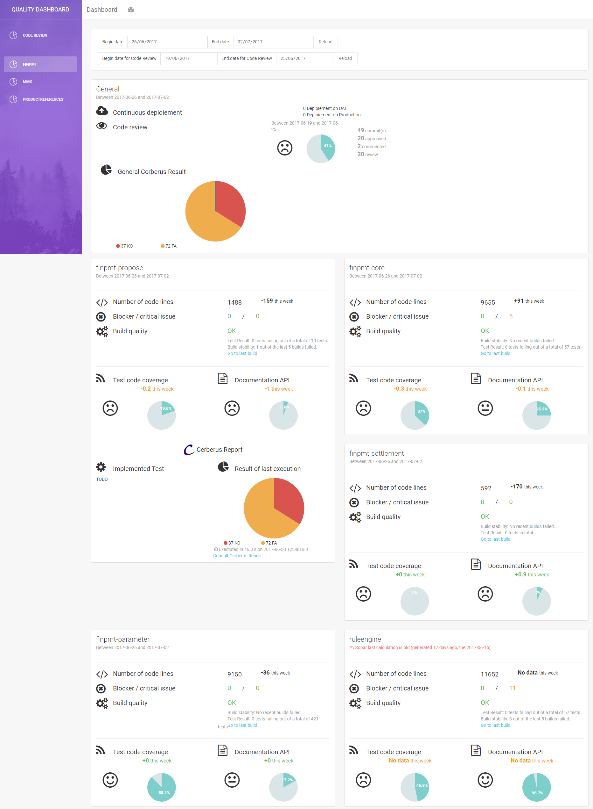

## Quality Dashboard

### What is it ?


This application allows to aggregate data from qualities tools on only 1 dashboard.

It's write on : 
* Node JS for server
* Javascript on front

Connectors available : 
* [SonarQube](https://www.sonarqube.org/) (Code quality tools)
* [Jenkins](https://jenkins.io/) (CI Tools)
* [CordonBleu](https://github.com/BenRomberg/cordonbleu/) (Code review tools)
* [Cerberus](https://www.cerberus-testing.org/) (Automation Test tools)
* Make your own connector using `Add new connector` section. Don't hesitate to propose pull request with your own connectors.

**You can see here a print screen of this dashboard :**

<a href="docs/print_screen.png" target="_blank"></a>


### Run application

#### Run with Github
After pulling project, you have to install Node.

To start QualityDashboard:
```
.\start.sh
```

to stop :

```
.\stop.sh
```
Application logs are available on logs folder.


#### Run with docker

see [docker](docker)  folder


### Settings 

To personalize settings, you have to use `conf.js`
Find here a "skeleton" of the file you have to write 
```
// init method with
// minimal settings
exports.initProject = function() {

    let conf = new Object();
    conf.dashboardSettings = new Array();


    // ***************************  Plugin settings ******************************/
    conf.generalPluginToUse = ["CordonBleuInfo"];
    conf.modulePluginToUse = ["SonarInfo", "JenkinsInfo", "CerberusGetLastInfo", "DeploiementFiguresInfo"]; // TODO describe Plugin

    // *************************** General url settings **************************/
    conf.toolsUrlSettings = {
        server: { // server url of QualityReport (mandatory)
            host: "localhost",
            port: "8085"
        },
        // from here, each tools is optionnal. Open an issue if you find a tools non optionnal
		/*    sonar : { // sonar is tools who generate many quality kpi
		 *       host :"sonar_host",
		 *       port :"9000",
		 *   },
		 *   jenkins : { // jenkins is the CI tools
		 *       host : "jenkins_host",
		 *       port : "8210"
		 *       user : "user jenkins",
         *       userToken : "token generate by jenkins" // you can generate this token directly on jenkins, on your profile page
		 *   },
		 *   cerberus : { // cerberus is a testing tools
		 *       host : "cerberus_host",
		 *       port : "80"
		 *   },
		 *   cordonBleu : { // cordon bleu is a code review tools
		 *       host : "cordon_bleu_host",
		 *       port : "8080",
		 *       database_host : "****",
		 *       database_user : "****",
		 *       database_password : "****"
		 *   }
		 */
    };

    // ****************************** Code review entry settings *********************/
    // if you don't want use code review entry, don't write this lines
	/*
	 * conf.codeReviewSettings = {
	 *
	 *   teams :
	 *       [
	 *           {name : "finpmt"}, // team name into cordon bleu tools
	 *           {name : "mmk"},
	 *           {name : "selecteur"},
	 *           {name : "xtpi"} //
	 *       ]
	 * };
	 */

    // ****************************** Project dashboard settings *********************/
    conf.dashboardSettings.push(
        {
            name: "team name", // team name display on dashboard : mandatory
			/*    codeReviewName : "finpmt", // team name into cordon bleu tools
			 *   responsible : { // responsible of the team
			 *       name : "TATA Toto",
			 *       email : "toto@gmail.com"
			 *   },
			 */
            projects: [
                {
                    name: "project_1_name", // name display on dashboard : mandatory
					/*
					 *    sonarName : "org.toto:project_1", // sonar identifier
					 *    cerberusPrefixTag : "project_1_20", // prefix use by cerberus to generate execution tag
					 *    jenkinsName : "finpmt-propose", // name of build job on jenkins
					 *    jenkinsDeploiementPPRODName : "project_1-DEPLOY-PPROD", // name of delivery job on PPROD on jenkins
					 *    jenkinsDeploiementPRODName : "project_1-DEPLOY-PROD", // name of delivery job on PROD on jenkins
					 */
                },
                {
                    name: "project_2_name",
					/*
					 *    sonarName : "org.nicodeur:project_1",
					 *    cerberusPrefixTag : "Project_1_name-20",
					 *    jenkinsName : "project_1",
					 */
                }/*, { .....}*/
            ]
        }
    );

    /********************************* Don't touch ! *****************************/

    return conf;

}

```

### Technical 

#### Design


#### Add new connector

TODO