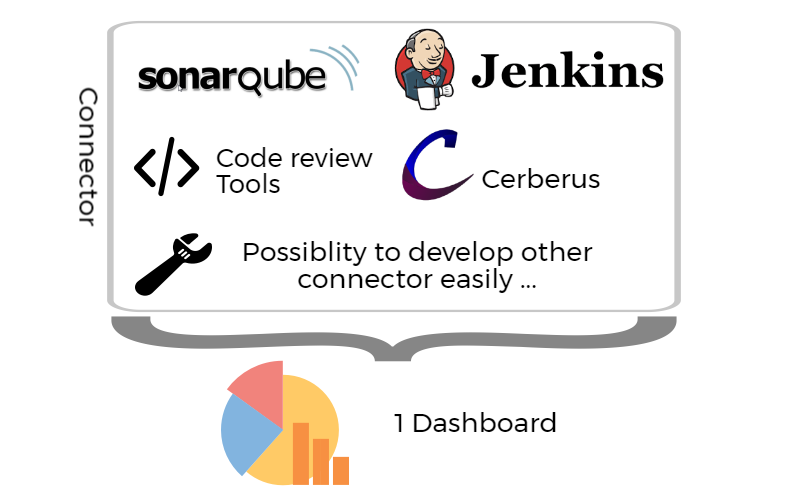
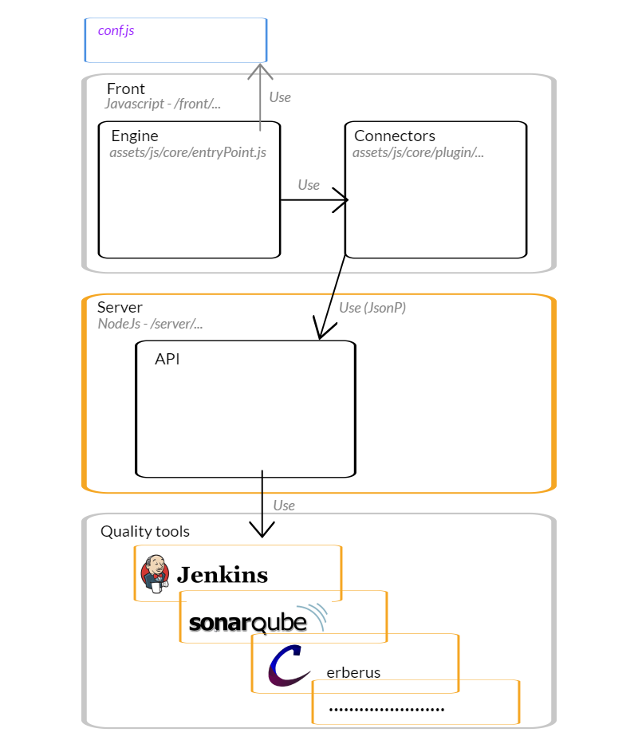

## Quality Dashboard



This application allows to aggregate data from qualities tools on only 1 dashboard.

It's write on : 
* Node JS for server
* Javascript on front

Connectors available : 
* [SonarQube](https://www.sonarqube.org/) (Code quality tools)
* [Jenkins](https://jenkins.io/) (CI Tools)
* [CordonBleu](https://github.com/BenRomberg/cordonbleu/) (Code review tools)
* [Cerberus](https://www.cerberus-testing.org/) (Automation Test tools)
* Make your own connector using `Add new connector` section. Don't hesitate to propose pull request with your own connectors.

### Run application

#### Run with Github
After pulling project, you have to install Node.

To start QualityDashboard:
```
.\start.sh
```

to stop :

```
.\stop.sh
```
Application logs are available on logs folder.


#### Run with docker

A docker folder with Dockerfile exist. Just run cmd : 
```
docker build -t qualityDashboard:1.0 .
docker run -v <pathToLog>:/opt/qualityReport/logs -t myQualityDashboard -p 8085:8085 -p 8086:8086 qualityDashboard 
```

TODO : add -v to share your `conf.js`
TODO : create a offical docker image


### Settings 

To personalize settings, you have to use `conf.js`
```
	conf.toolsUrlSettings = {
		server : { // server url of QualityReport
			host : "localhost",
			port : "8085"
		 },
		sonar : { // sonar is tools who generate many quality kpi
			host :"192.168.135.14",
			port :"9000",
		},
		jenkins : { // jenkins is the CI tools
			host : "192.168.134.55",
			port : "8210"
		},
		cerberus : { // cerberus is a testing tools
			host : "cerberus.siege.red",
			port : "80"
		},
		cordonBleu : { // cordon bleu is a code review tools
			host : "192.168.134.148",
		 	port : "8080",
			database : "blabla"
		}
	};
```

```
	conf.dashboardSettings.push(
		{
			name : "project_name", // project/service name 
			codeReviewName : "project_name_on_cordon_bleu",
			responsible : { // responsible of this application
				name : "DUPIRE Veronique",
				email : "vdupire@redoute.fr"
			},
			projects : [ // describe each module
				{
					name : "finpmt-propose",
					sonarName : "redoute.finpmt:finpmt-proposal-parent",
					cerberusPrefixTag : "Jenkins-20",
					jenkinsName : "finpmt-propose",
				},
				{
					name : "finpmt-core",
					sonarName : "redoute.finpmt:finpmt-core-parent",
					cerberusPrefixTag : null,
					jenkinsName : "finpmt-core",
				},
				{
					name : "finpmt-settlement",
					sonarName : "redoute.finpmt:finpmt-settlement-parent",
					cerberusPrefixTag : null,
					jenkinsName : "finpmt-settlement",
				},
				{
					name : "finpmt-parameter",
					sonarName : "redoute.finpmt:finpmt-parameter-parent",
					cerberusPrefixTag : null,
					jenkinsName : "finpmt-parameter",
				},
				{
					name : "ruleengine",
					sonarName : "redoute.common.core:ruleengine",
					cerberusPrefixTag : null,
					jenkinsName : "redoute-common-core-ruleengine",
				}
			]
		});
```

### Technical 

#### Design


#### Add new connector
